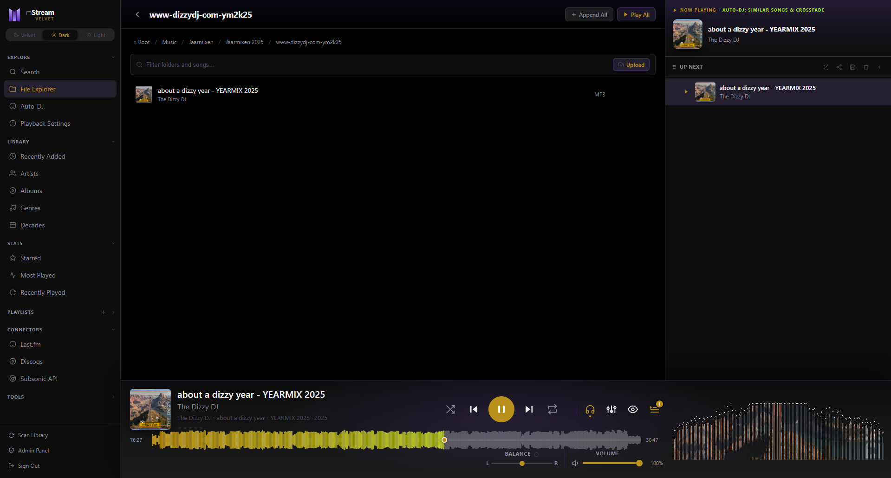
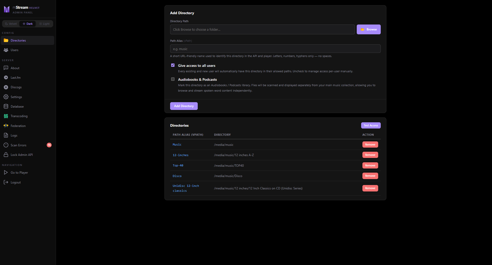

# mStream Velvet

> **A heavily extended fork of [mStream](https://github.com/IrosTheBeggar/mStream) by [aroundmyroom](https://github.com/aroundmyroom).**

**Current version: [6.2.2-velvet](releases/v6.2.2-velvet.md)** — April 2026

[](https://discord.gg/KfsTCYrTkS)

**Join our [Discord server](https://discord.gg/KfsTCYrTkS)** for direct contact — questions, feature requests, bug reports, and general chat about mStream Velvet.

> All code changes in this fork were generated by Claude Sonnet 4.6 through VS Code with GitHub Copilot. This application is not vibe coded — we know what we develop and we know how we want it to function. All features are extensively documented.

mStream Velvet is a personal music streaming server with a dramatically expanded feature set compared to classic mStream. It is built on mStream 5.14.3 (sqlite branch) and adds a new player UI, Subsonic API compatibility, advanced audio tools, and many more features.

| Player UI | Admin UI |
|:---------:|:--------:|
| [](docs/designs/front.png) | [](docs/designs/admin.png) |

---

## What's New vs Classic mStream

| Area | Classic mStream | mStream Velvet |
|---|---|---|
| UI themes | Light / Dark toggle | Velvet / Dark / Light 3-way segmented selector |
| Player bar | Basic controls | VU needle meters, RTW 1206 PPM, spectrum analyser (3 modes) |
| Waveform | ❌ | ✅ RMS + γ-curve server-side generation, 600-point display |
| Auto-DJ | Basic random | Similar Artists (Last.fm), cooldown, crossfade, persistent settings, artist-fair selection |
| Subsonic API | ❌ | ✅ Full REST 1.16.1 + Open Subsonic (DSub, Substreamer, Symfonium, etc.) |
| Discogs art | Basic search | Parallelised, WAV-safe, allow-update toggle, orphan cleanup |
| Tag editing | ❌ | ✅ ID3 tag editor from Now Playing modal (admin-controlled) |
| Album art theming | ❌ | ✅ Dynamic CSS variables extracted from cover art per track |
| CUE sheet markers | ❌ | ✅ Embedded + sidecar `.cue` with clickable seek ticks |
| Genre browsing | ❌ | ✅ Normalised genre list with multi-value splitting |
| Decade browsing | ❌ | ✅ Decade album grid with virtual scroll |
| Scan error log | ❌ | ✅ Persistent, deduplicated per-file error log in admin |
| Live scan progress | ❌ | ✅ Shown in admin panel and player header in real time |
| Admin panel | Materialize CSS | Fully restyled GUIv2 admin — no Materialize |
| Gapless playback | ❌ | ✅ Web Audio scheduled swap, 20 ms crossfade ramp |
| Stereo balance | ❌ | ✅ StereoPannerNode with balance-aware metering |
| Sleep timer | ❌ | ✅ 15/30/60/90 min + end-of-song with volume fade |
| Crossfade | ❌ | ✅ 0–12 s configurable, in both Auto-DJ and Playback Settings |
| SQLite performance | Default | 32 MB cache, prepared-statement cache, 6 extra indexes, MEMORY temp store |
| Track duration | ❌ | ✅ Stored in DB, returned by all track endpoints |
| Play history reset | ❌ | ✅ Per-user reset for Most Played and Recently Played |
| Cross-device sync | localStorage only — lost on new browser | ✅ All prefs and queue persisted to DB; any device/browser resumes where you left off |
| Search | Single-field LIKE scan | ✅ FTS5 full-text index; BM25 relevance ranking; prefix (`talk*`), exclusion (`-word / NOT word`), diacritic folding; results split into Folders / Artists / Songs sections |
| Full-screen visualizer | ❌ | ✅ Milkdrop/Butterchurn, Custom Spectrum (7 modes), AudioMotion-analyzer (6 presets) |
| Scan error repair | ❌ | ✅ Fix button re-muxes corrupt FLAC/MP3/WAV in-place; unrecoverable files flagged |
| Internet radio | ❌ | ✅ Stream stations via proxy; station logos cached; drag-to-reorder; ICY now-playing metadata + kbps badge; scheduled & on-demand recording; **station logo embedded in all recorded formats** |
| YouTube download | ❌ | ✅ Save any YouTube video as tagged MP3/Opus to your library via yt-dlp; album art embedded; temp files fully isolated from music folder |
| Podcasts | ❌ | ✅ RSS subscribe, episode browse & play, progress tracking, feed refresh, drag-to-reorder, RSS URL editing, save episode to server |
| Genre Groups | ❌ | ✅ Admin panel to define named genre buckets used across genre browsing and smart playlist filtering; drag-to-reorder, auto-seeded defaults |
| Smart Playlists | ❌ | ✅ Rule-based playlists: genre group, year range, min rating, play status, artist search, library (vpath) filters; Fresh Picks daily-shuffle mode |
| ZIP download | ❌ | ✅ Download current album or playlist as a ZIP with configurable server-side size guard |
| ListenBrainz | ❌ | ✅ Scrobbling + instant "listening now" ping; runs alongside Last.fm |
| On-demand album art | ❌ | ✅ Art extracted from embedded tags for unscanned files — shown in player bar, queue, file list, and recordings view without needing a scan |

---

## Features Overview

### Player

- **3-theme system** — Velvet (navy/purple), Dark (near-black), Light (lavender-grey); OS colour-scheme auto-detection
- **Visualizer modes** — Mini spectrum analyser, analogue VU needle dials (L+R), RTW 1206 PPM bar meters
- **Waveform display** — Server-generated via ffmpeg, RMS-based, γ=0.7 loudness curve, cached per file
- **Dynamic album-art colouring** — `--primary` and `--accent` CSS variables resampled from cover art on every track change
- **Crossfade** — True Web Audio element swap; configurable 0–12 s
- **Gapless playback** — Scheduled via Web Audio clock, 20 ms ramp, zero gap
- **Stereo balance** — Post-EQ StereoPannerNode; balance-aware VU/PPM metering
- **EQ** — 8-band parametric, ±12 dB, presets, bypass toggle
- **Sleep timer** — Presets with 40-step volume fade-out
- **Full-screen visualizer** — Milkdrop/Butterchurn (preset cycling), Custom Spectrum (7 modes), AudioMotion-analyzer (6 curated presets: Mirror Peaks, LED Dual, Radial, Octave Reflex, Velvet, Line Stereo)
- **Cross-device sync** — All preferences and queue saved to DB; any device/browser resumes where you left off
- **FTS5 search** — Full-text index across title, artist, album, filepath; BM25 relevance ranking; prefix matching (`talk*`); exclusion queries (`talking -heads`); diacritic folding; results split into Folders, Artists, and Songs sections
- **Navigation customisation** — Show/hide Genres and Decades nav buttons per user
- **Queue drag-and-drop reordering** — With persistent localStorage state
- **CUE sheet markers** — Tick marks on seek bar with seek-on-click and tooltips
- **Genre & Decade browsing** — Sidebar views with virtual scroll
- **Player bar position** — Top or bottom, configurable per user
- **Auto-Resume** — Opt-in setting to resume playback on page reload

### Auto-DJ

- **Similar Artists mode** — Last.fm API, artist-fair two-stage selection (equal weight per artist)
- **Artist cooldown** — 15-song window persisted across reloads
- **Minimum rating filter** — Persisted per user
- **vpath filter** — Restrict picks to specific music folders
- **Crossfade integration** — Shared slider with Playback Settings

### Subsonic API

- Full **Subsonic REST 1.16.1** with Open Subsonic extensions (`openSubsonic: true`)
- Works with **DSub, Substreamer, Symfonium, Ultrasonic**, and other Subsonic clients
- MD5 token auth and plaintext auth; separate per-user Subsonic password (does not conflict with mStream's PBKDF2 passwords)
- XML and JSON response formats; JSONP supported
- Folder-browsing mode (`getIndexes`, `getMusicDirectory`) with real filesystem hierarchy
- Cover art for folders and songs; SVG folder-icon fallback
- Starred, rated, bookmarks, playlists, scrobble all implemented

### Admin Panel

- Fully restyled with GUIv2 CSS variables (no Materialize)
- Rich library stats: tracks, artists, albums, genres, formats, art coverage, ReplayGain, decades, per-vpath breakdowns
- Scan error log with type filter, retention setting, in-place FLAC/MP3/WAV repair (stream-copy + frame-level re-encode fallback), unrecoverable file detection, gone-from-library indicator, and post-rescan confirmation status
- Live scan progress polling (admin + player header)
- Directory access test (read/write per vpath, OS-specific advice)
- Discogs: allow-update toggle
- Last.fm: server-side enable/disable toggle
- ID3 tag editor toggle (per-installation setting)
- Logout confirmation + BroadcastChannel to stop player in all open tabs
- Genre Groups ("Groups & Genres") — define named buckets that map raw genre tags into display groups; used in genre browsing sidebar and as filter options in smart playlists; drag-to-reorder, inline add/delete, auto-seeded with defaults on first visit

### Internet Radio

- Stream any HTTP/HTTPS radio station through the built-in proxy (required for ICY headers in modern browsers)
- Station artwork fetched and cached on subscribe; SSRF-protected (no private IPs)
- ICY `icy-title` now-playing metadata polled and shown in the player bar; stream bitrate badge (kbps) shown when advertised
- Admin enable/disable toggle; per-user station list with add/edit/delete/reorder
- Drag-to-reorder stations; filter pills by Genre and Country
- **On-demand recording** — users with the `allow-radio-recording` permission (admin-granted per user) can record any stream to a configured Recordings folder; file naming includes station name, date, and time; station logo embedded as cover art; write-permission checked before start
- **Scheduled recording** — tabbed Record modal with a Schedule tab; recurrence modes: Once, Every day, Weekdays, Custom days; 30 s server-side ticker fires recordings even when the browser is closed; active schedules shown with On/Off toggle and delete

### Podcasts

- Subscribe to any RSS podcast feed — no external account required
- Episode list with title, date, duration, and play button
- Per-episode play-position progress saved to DB; resume on next visit
- One-click feed refresh — re-downloads missing artwork automatically
- Drag-to-reorder feeds
- Inline edit panel per feed: rename display name and update the RSS URL
- **Save episode to server** — download any episode directly to the AudioBooks vpath (`<feed title>/<YYYY-MM-DD title.ext>`); streaming pipeline (no RAM buffering); SSRF-guarded; per-button states (idle → spinner → ✓ / ✕)

### Smart Playlists

- **Filter builder** — combine genre group, year range, minimum rating, play status (played / unplayed), artist name search, and library (vpath) selection into a single rule-based playlist
- **Fresh Picks** — per-playlist toggle for daily-shuffle mode: auto-shuffles once per day on first open, "New picks" button to reshuffle at any time; shuffle icon shown in the nav sidebar
- **Library filter** — narrow picks to one or more configured music directories; child vpaths resolved to filepath prefix automatically
- **CRUD management** — create, rename, edit filters, delete; each playlist remembers its own sort order
- **Inline preview** — run a playlist before saving to see the live track count

### ZIP Download

- **ZIP button in the page header** — appears when viewing an album or playlist; hidden on all other views
- Albums download with the album name as filename; playlists use the playlist name
- Server performs a pre-flight size check; rejects with HTTP 413 and a descriptive toast if over the limit
- Configurable max size (default 500 MB) in Admin → DB Scan Settings → Max ZIP Download Size

### ListenBrainz

- Admin enables ListenBrainz server-wide; each user connects with their own user token
- Token validated against the ListenBrainz API on connect
- Scrobble fires 30 s after track start (`listen_type: "single"`)
- **Instant "Listening Now" ping** — fires immediately on track start so the current track appears on the LB dashboard in real time
- Runs alongside Last.fm — both can be active simultaneously; the scrobble status badge shows combined state

---

## Installing

### Docker

Pull the pre-built image directly — no clone or build needed:

```shell
docker pull ghcr.io/aroundmyroom/mstream-velvet:latest
```

Create a `compose.yaml`:

```yaml
services:
  mstream:
    image: ghcr.io/aroundmyroom/mstream-velvet:latest
    container_name: mstream-velvet
    restart: unless-stopped
    ports:
      - "3000:3000"
    volumes:
      - ./save:/app/save            # config, database, logs
      - /media/music:/music         # your music library (adjust host path)
      - ./waveform-cache:/app/waveform-cache
      - ./image-cache:/app/image-cache
    environment:
      MSTREAM_MUSIC_DIR: /music     # must match the volume target above

      # Admin account (optional).
      # If omitted the server starts in open mode — no login required.
      # MSTREAM_ADMIN_USER: admin
      # MSTREAM_ADMIN_PASS: changeme

      # Extra feature folders — uncomment to enable.
      # By default each type is applied directly to MSTREAM_MUSIC_DIR (/music).
      # If your files live in a sub-folder, add the matching *_SUBDIR variable:
      #   MSTREAM_ENABLE_YOUTUBE: "true"
      #   MSTREAM_YOUTUBE_SUBDIR: YouTube        # → folder root becomes /music/YouTube
      # You can also add, change or remove folders at any time in the Admin panel.
      # For full control, skip env vars and edit save/conf/default.json directly.

      # AudioBooks & Podcasts  (type: audio-books)
      # MSTREAM_ENABLE_AUDIOBOOKS: "true"
      # MSTREAM_AUDIOBOOKS_SUBDIR: Audiobooks    # optional — omit to use /music directly

      # Radio Recordings  (type: recordings — also enables the radio feature)
      # MSTREAM_ENABLE_RECORDINGS: "true"
      # MSTREAM_RECORDINGS_SUBDIR: Recordings    # optional — omit to use /music directly

      # YouTube Downloads  (type: youtube)
      # MSTREAM_ENABLE_YOUTUBE: "true"
      # MSTREAM_YOUTUBE_SUBDIR: YouTube          # optional — omit to use /music directly
```

```shell
docker compose up -d
```

Open **http://localhost:3000** — on a fresh install with no users the admin panel is accessible without login.

> The `environment:` block is optional — env vars only apply on the **first boot** when no config exists yet.
> For multiple mount points, child-vpaths, `albumsOnly`, or any advanced layout, skip the env vars and edit `save/conf/default.json` directly instead. See [docs/docker.md](docs/docker.md).

Or pin to a specific release:

```shell
docker pull ghcr.io/aroundmyroom/mstream-velvet:v6.2.2-velvet
```

**Build from source** (optional):

```shell
git clone https://github.com/aroundmyroom/mStream.git
cd mStream
docker build -t mstream-velvet .
# then use  image: mstream-velvet  in compose.yaml
```

See [docs/docker.md](docs/docker.md) for the full Docker guide: volume setup, adding your music library, user creation, updating, and reverse-proxy tips.

### Bare-metal (Linux / systemd)

```shell
git clone https://github.com/aroundmyroom/mStream.git
cd mStream
npm install --only=prod
node cli-boot-wrapper.js
```

See [docs/install.md](docs/install.md) for running as a background service with systemd or PM2.

See [docs/deploy.md](docs/deploy.md) for reverse-proxy (nginx) configuration — required for large FLAC libraries to avoid stall on idle connections.

See [docs/technology-choices.md](docs/technology-choices.md) for a full explanation of every technology and service used.

---

## Updating

**Docker:**
```shell
git pull
docker build -t mstream-velvet .
docker compose up -d
```

**Bare-metal:**
```shell
git pull
npm install --only=prod
systemctl restart music.service   # or: pm2 restart all
```

---

## Mobile Apps

### Official mStream app (uses native mStream API)

[](https://apps.apple.com/us/app/mstream-player/id1605378892)

[](https://play.google.com/store/apps/details?id=com.nieratechinc.mstreamplayer&hl=en_US)

[Made by Niera Tech](https://mplayer.nieratech.com/) — connects directly to the mStream API (not Subsonic).

### Subsonic-compatible clients

The built-in Subsonic REST API also lets you use any Subsonic-compatible app:

- **DSub** (Android)
- **Substreamer** (iOS)
- **Symfonium** (Android)
- **Ultrasonic** (Android)

---

## Technical Details

- **Node.js:** v22 or greater (v24 used in Docker image; tested on v22.22.0)
- **Database:** SQLite via Node.js built-in `node:sqlite` (`DatabaseSync`) — default engine
- **Docker base image:** `node:24-alpine`
- **Supported audio formats:** flac, mp3, mp4, wav, ogg, opus, aac, m4a, w64, aiff
- **ffmpeg:** auto-downloaded to `bin/ffmpeg/` at startup if missing or below v6 (bare-metal and Docker); waveform generation, radio recording, YouTube tagging, and transcoding all use this bundled binary
- **Cross-platform:** Linux, macOS, Windows, FreeBSD, ARM (Raspberry Pi)

---

## Releases

Individual release notes are in the [`releases/`](releases/) folder.  
Full combined changelog: [`changes-fork-velvet.md`](changes-fork-velvet.md)

---

## Credits

mStream Velvet is built on [mStream](https://github.com/IrosTheBeggar/mStream) by IrosTheBeggar and on these open-source libraries:

- [music-metadata](https://github.com/Borewit/music-metadata) — metadata parser for Node.js
- [LokiJS](https://github.com/techfort/LokiJS) — in-memory JS database (legacy/fallback mode)
- [Butterchurn](https://github.com/jberg/butterchurn) — Milkdrop visualizer in JavaScript
- [audioMotion-analyzer](https://github.com/hvianna/audioMotion-analyzer) — Audio spectrum visualizer
